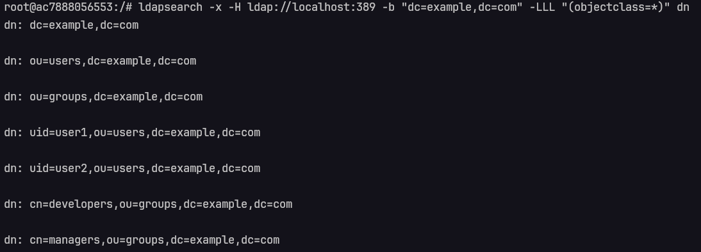
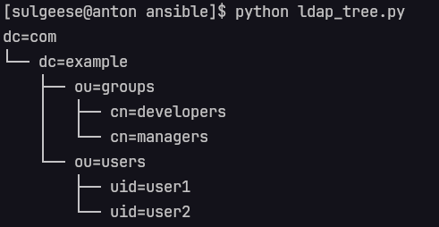

# Ansible Project: OpenLDAP Automation

Этот Ansible проект:
*   На ОС Ubuntu LTS Устанавливает OpenLDAP сервер;
*   Устанавливает в LDAP пароль администратора;
*   Устанавливает в LDAP `domain` и `organization`;
*   Добавляет 2 пользователя в LDAP;
*   Добавляет 2 группы в LDAP.


## Предварительные требования

### На целевой машине
*   Установлена Ubuntu LTS (предпочтительная версия 20.04 или 22.04);
*   Запущен SSH-сервер и настроен для подключения с правами `sudo`;
*   Установлен `python3` (версии 3.8+) и `python3-pip`.

### На машине, в которой запускается плейбук
*   Ansible (версия 2.4+);


## Инструкция по установке и настройке

1.  **Клонируйте репозиторий**:

    ```bash
    git clone https://github.com/sulgeese/ansible-ldap.git ansible-ldap
    cd ansible-ldap
    ```

2.  **Настройте Inventory**:

    Отредактируйте файл `inventory/hosts` и укажите IP-адрес (или DNS-имя) вашего сервера LDAP. В файле `group_vars/ldap_servers` укажите переменные, которые нужны для этой группы серверов. Например, `ansible_password` (пароль для подключения по SSH), `ansbile_user` (имя пользователя для SSH-подключения), `ansible_ss_private_key_file` (если вместо пароля для подключения по SSH используете ключ) и тд.  Пример:

    `inventory/staging.ini`
    ```ini
    [ldap_servers]
    your_ldap_server_ip
    ```

    `group_vars/ldap_servers`
    ```yaml
    ansible_password: 3632
    ansible_user: root
    ```

3.  **Настройте переменные**:

    В файле `ansible/roles/openldap/vars/main.yml`:

    *   `ldap_admin_password`: Замените на надежный пароль для администратора LDAP (по умолчанию, `password`).
    *   `ldap_domain`: Замените на ваш домен (по умолчанию, `example.com`).
    *   `ldap_organization`: Замените на название вашей организации (по умолчанию, `organization`).


    **Описание других переменных (пользователи, группы) подробнее см. в [openldap/README.md](ansible/roles/openldap/README.md).**

## Запуск плейбука

```bash
ansible-playbook playbook.yml
```


## Запуск тестового сервера с Ubuntu:22.04

> [!warning]
> **Для выполнения этой команды должен быть установлен Docker и Docker Compose.**


```bash
docker compose up -d
```

## Итоговый результат LDAP Directory Tree

#### Сырой


#### Преобразованный

